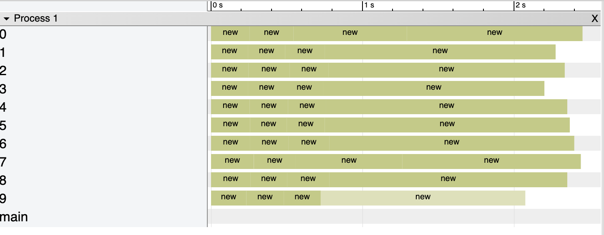

# Rust Memory Allocator
POC to show that attempting to rapidly allocate over 50% of machine memory causes incremental allocations to slow. I presume this is due to the system allocator requiring time to reorg RAM to provide large contiguous blocks.

*Image shows the `tracing-chrome` graph for an attempted allocation of 40GB/64GB. Note the final allocation is ~8x slower.*

Tested on an M1Pro and M1Max.